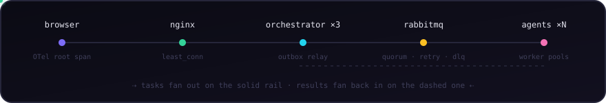
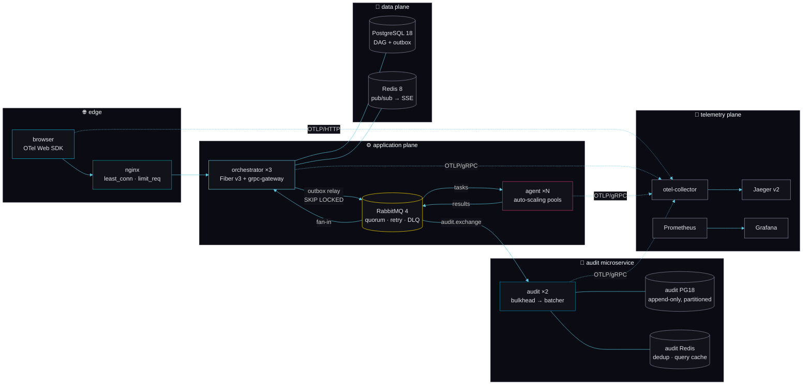
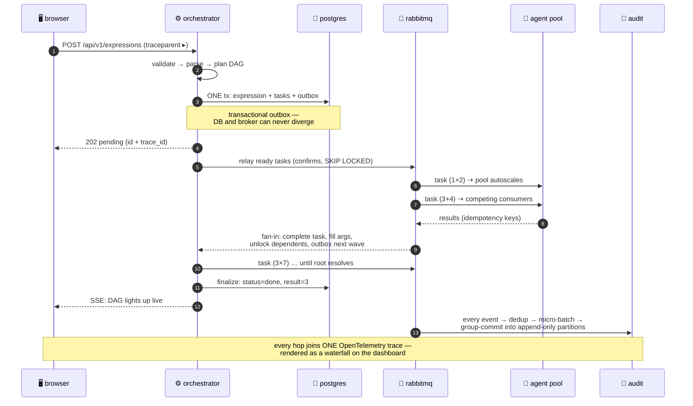
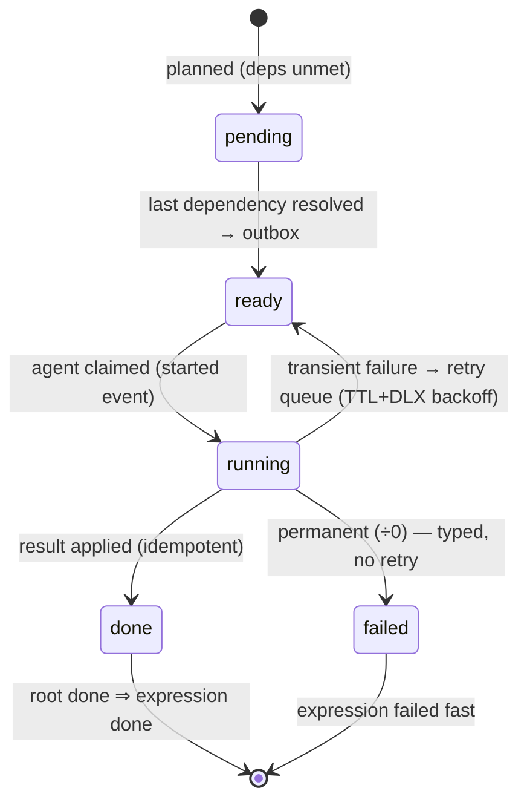
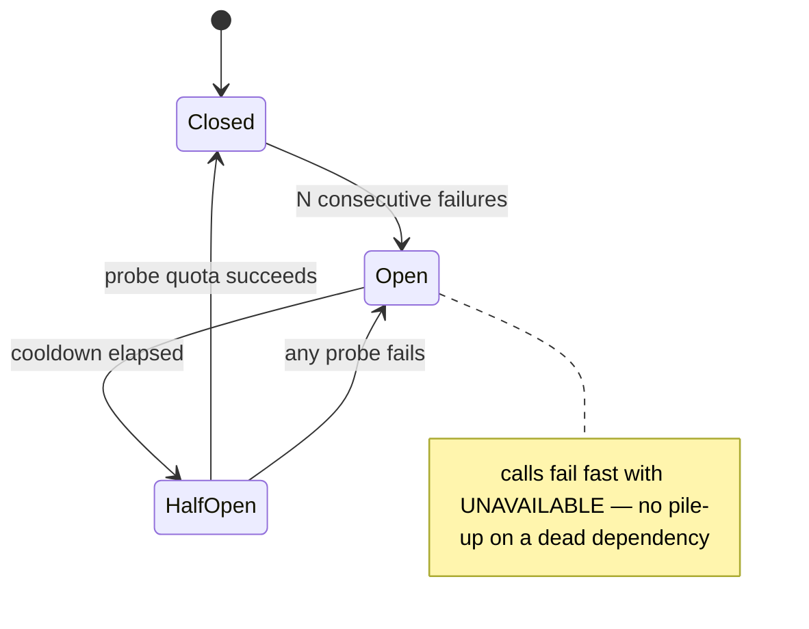

<div align="center">



<br/>

**A distributed calculator that treats `(2+2)*3` the way a highload system treats real work** —
parsed into a DAG, fanned out over RabbitMQ to auto-scaling worker fleets, fanned back in through a
transactional outbox, audited immutably in a separate microservice, and traced
**from the click in your browser to the goroutine that adds the numbers**.

<br/>

[](backend/go.mod)
[](https://gofiber.io)
[](deploy/docker-compose.yml)
[](backend/pkg/redis)
[](backend/pkg/rabbitmq)
[](frontend)
[](backend/pkg/otel)

[](.github/workflows/ci.yml)
[](backend/build/golangci.yml)
[](backend)
[](backend/integration)
[](LICENSE)

<br/>

[**Quickstart**](#-quickstart) · [**Architecture**](#-architecture) · [**Life of an expression**](#-life-of-an-expression) ·
[**Pattern catalog**](#-pattern-catalog) · [**Prove it**](#-prove-it-break-things) · [**Tour**](#-the-guided-tour)

</div>

---

## ✨ What is this?

A **teaching-grade, production-shaped** distributed system built on the clean-architecture layering of
[evrone/go-clean-template](https://github.com/evrone/go-clean-template). Every pattern people
name-drop in system-design interviews is here — **real, small enough to read, and proven by a test**:

<table>
<tr>
<td width="33%" valign="top">

**🧮 The workload**
Expressions become DAGs of single-operation tasks. `((1+2)*(3+4))/7` = 4 tasks, computed by
*competing agents* across the fleet, reassembled by fan-in, finalized when the root resolves.

</td>
<td width="33%" valign="top">

**📊 The visibility**
A dark Next.js dashboard shows the DAG lighting up live (SSE), the worker pools autoscaling,
the audit stream — and renders the **actual distributed trace** of each expression as a waterfall.

</td>
<td width="33%" valign="top">

**🛡 The resilience**
Transactional outbox, publisher confirms, idempotent consumers, TTL+DLX retry queues, DLQ
with operator redrive, circuit breakers, bulkheads, rate limits, load shedding, graceful drains.

</td>
</tr>
</table>

## 🏗 Architecture

<div align="center">

</div>



## 🔄 Life of an expression

One submit, six services, one trace. This exact flow is verified by the E2E smoke test —
`((1+2)*(3+4))/7` → **3**, tasks genuinely split across both agents:



<details>
<summary><b>🔁 Task state machine</b> (click to expand)</summary>



</details>

<details>
<summary><b>🔌 Circuit breaker states</b> (click to expand)</summary>



</details>

## 🚀 Quickstart

```bash
cp .env.example .env      # defaults work out of the box
make up                   # builds 4 images, boots 18 containers
open http://localhost     # ✨ the dashboard
```

Submit `((1+2)*(3+4))/7`, click the expression, and watch:

| Where | What you see |
|---|---|
| **Task graph** tab | DAG nodes pulse amber while computing, turn green as results land, edges draw in as dependencies unlock — with the computing agent's name on every node |
| **Distributed trace** tab | The same expression as a span waterfall: `browser → orchestrator → queue-wait → agent compute → fan-in`, deep-linked to Jaeger |
| [`/workers`](http://localhost/workers) | Goroutine pools autoscaling with load, reconstructed from audit events |
| [`/audit`](http://localhost/audit) | The append-only log: filterable, keyset-paginated, live ingest stats |
| [`/tour`](http://localhost/tour) | A 9-step guided walkthrough of how all of it works |

**Backstage passes:** [Jaeger](http://localhost:16686) · [Grafana](http://localhost:3001) (dashboard pre-provisioned) · [RabbitMQ](http://localhost:15672)

## 🧩 Pattern catalog

Each pattern is its own package with its own test. The table is the map; the code is the territory.

| Pattern | Where | Proven by |
|---|---|---|
| 🏛 Clean architecture | [`backend/internal/`](backend/internal) | dependency rule: inner layers import nothing outer |
| 🔀 Fan-out / fan-in | [`usecase/scheduler`](backend/internal/usecase/scheduler) | [`pipeline_test.go`](backend/integration/pipeline_test.go) — args propagate, deps unlock |
| 🧵 Auto-scaling worker pool | [`pkg/workerpool`](backend/pkg/workerpool) | race-detector tests: grows to Max, shrinks to Min |
| 📤 Transactional outbox | [`repo/persistent`](backend/internal/repo/persistent) | DB state and broker never diverge |
| ⏳ Retry queue (TTL + DLX backoff) | [`pkg/rabbitmq`](backend/pkg/rabbitmq) | full audit test: transient failures ride the loop |
| ☠️ DLQ + operator redrive | [`pkg/rabbitmq`](backend/pkg/rabbitmq), `/api/v1/dlq/*` | poison message parks; requeue endpoint drains |
| 🔌 Circuit breaker (3-state) | [`pkg/circuitbreaker`](backend/pkg/circuitbreaker) | state-machine unit tests incl. half-open probes |
| 🎲 Jittered exponential retry | [`pkg/retry`](backend/pkg/retry) | permanent errors short-circuit, cancel respected |
| 📦 Micro-batching / group commit | [`pkg/batcher`](backend/pkg/batcher) | 400 msgs (with dups) → exactly 200 rows |
| 🚧 Bulkhead isolation | [`pkg/bulkhead`](backend/pkg/bulkhead) | saturation sheds with `OVERLOADED`, never queues unboundedly |
| 🪣 Token-bucket rate limiting | [`pkg/ratelimit`](backend/pkg/ratelimit) + nginx + gRPC interceptor | three-ring defense in depth |
| 🍃 Load shedding | audit gRPC write path | `RESOURCE_EXHAUSTED` + `Retry-After` under pressure |
| 🔂 Idempotent consumers | Redis `SETNX` fast path + PG `ON CONFLICT` backstop | dedup survives Redis loss |
| 🪨 Append-only store | [`backend/db/audit`](backend/db/audit) | trigger rejects `UPDATE`/`DELETE` — tested |
| 🧲 Singleflight collapse | [`usecase/audit/query.go`](backend/internal/usecase/audit/query.go) | N identical queries → 1 DB hit |
| 📄 Keyset pagination | audit queries | full walk: no gaps, no overlaps |
| 🕊 Graceful shutdown | [`internal/app`](backend/internal/app) | drain pool → flush batcher → deadline-bounded `GracefulStop` |
| 🔍 End-to-end tracing | [`pkg/otel`](backend/pkg/otel) + [`frontend/lib/otel-client.ts`](frontend/lib/otel-client.ts) | E2E: 8 spans, 2 services, ONE trace — through the broker |

## ⚡ The fastest stack, deliberately

| Concern | Choice | Why it wins |
|---|---|---|
| HTTP | **Fiber v3** (fasthttp) | fastest Go HTTP server; native net/http adapter hosts grpc-gateway **in-process** — zero loopback hops |
| JSON | **bytedance/sonic** | JIT/SIMD codec, wired into Fiber and every wire DTO via [`pkg/jsonx`](backend/pkg/jsonx) |
| Redis | **rueidis** | auto-pipelining (~14× go-redis throughput), server-assisted client-side caching |
| PostgreSQL | **pgx/v5 + sqlc** | binary protocol, compile-time-typed queries, `unnest` group commits |
| Protobuf | **vtprotobuf** | pooled, reflection-free marshaling on hot paths |
| Logging | **zap** | colored/emoji dev encoder, sampled JSON prod, `trace_id` on every line |
| Broker | **RabbitMQ 4** quorum queues | publisher confirms; competing consumers out-schedule any round-robin |
| Balancer | **nginx** `least_conn` + keepalive | smarter than round-robin; connection reuse |
| Frontend | **Next.js 16** Turbopack, standalone | smallest runtime image; RSC where it counts |
| Runtime | **automaxprocs + GOMEMLIMIT** | the scheduler and GC respect container quotas instead of discovering them via throttling/OOM |

## 🧪 Prove it (break things)

```bash
# Division by zero: permanent typed failure — fails fast, never retries.
curl -s -X POST localhost/api/v1/expressions -d '{"raw":"1/0"}' | jq

# Injection attempt: strict allow-list validation → 400 (and sqlc makes SQLi structurally impossible).
curl -s -o /dev/null -w '%{http_code}' -X POST localhost/api/v1/expressions -d '{"raw":"1; DROP TABLE tasks"}'

# Kill an agent mid-computation: unacked tasks redeliver to the surviving replica.
docker kill perfect-go-service-agent-1-1

# Inspect and redrive the dead-letter queue:
curl -s localhost/api/v1/dlq/tasks | jq
curl -s -X POST localhost/api/v1/dlq/tasks/requeue | jq

# Try to tamper with the audit log:
docker exec -it perfect-go-service-postgres-audit-1 psql -U audit -c "UPDATE audit_events SET actor='tamper'"
# ERROR:  audit_events is append-only: UPDATE rejected
```

<details>
<summary><b>🔬 The test pyramid</b> (click to expand)</summary>

| Layer | Command | What it proves |
|---|---|---|
| Unit (`-race`) | `make test` | parser vs reference evaluator, pool autoscaling, breaker transitions, batcher drain, limiter refill, validator allow-list |
| Integration (testcontainers) | `make test-integration` | **the full audit test**: 400 AMQP msgs with duplicates → exactly 200 rows in real PG18; poison → DLQ; immutability trigger; keyset walk; partition maintenance. Plus the DAG pipeline against real PG: fan-out → fan-in → unlock → finalize → audit trail complete |
| E2E smoke | stack up + `curl` | correct results across both agents, 400/404 mapping, one multi-service trace via Jaeger API |
| Static | `make lint` / `make vuln` | golangci-lint with **ALL linters enabled** (0 issues), gosec, govulncheck |

</details>

## 📁 Repository map

```
backend/                     ← the Go module
├── cmd/{orchestrator,agent,audit}/   thin mains (automaxprocs, config, run)
├── build/                   backend tool configs (golangci · sqlc · buf)
├── config/                  env-first runtime configuration (Go package)
├── internal/
│   ├── entity/              pure domain — imports nothing
│   ├── usecase/             business logic; owns its ports (interfaces)
│   ├── repo/                PG/Redis adapters (sqlc-generated + hand-written)
│   ├── controller/          gRPC · AMQP · Fiber HTTP transports
│   └── app/                 DI wiring, lifecycles, graceful shutdown
├── pkg/                     standalone pattern libraries — one concern each
├── proto/ · gen/            buf-managed contracts + generated code (drift-checked in CI)
├── db/{main,audit}/         goose migrations + sqlc queries, embedded into binaries
└── integration/             container-backed tests (the full audit test lives here)

frontend/                    ← Next.js 16 dashboard (build configs at app root — Next/TS require it)
deploy/                      ← docker-compose · Dockerfiles · config/ (nginx, prometheus, grafana, otel)
.github/workflows/           ← CI (path fixed by GitHub); every job is a `make` target
```

## 🛡 Security posture

- **Three throttle rings**: nginx `limit_req`/`limit_conn` → per-IP token buckets in Fiber → per-client gRPC interceptor
- Strict allow-list input validation · UUID validation · 64 KiB body caps · full timeout coverage
- Security headers everywhere; SSE and OTLP endpoints specifically hardened; browser trace headers never leak cross-origin
- **Containers**: scratch images (33–46 MB), non-root UID, `no-new-privileges`, read-only rootfs, segmented networks (databases unreachable from the edge), localhost-only ops UIs, resource limits + `GOMEMLIMIT`
- **Supply chain**: gosec on every lint, govulncheck against the Go vuln DB, pinned tool versions, codegen drift checks
- SQL injection impossible by construction: 100 % sqlc parameterized queries; the audit store physically cannot `UPDATE` or `DELETE`

## 📚 The skills library

The repo doubles as a curriculum: [`skills/`](skills/README.md) holds nine deep SKILL.md
teaching documents — [architecture](skills/golang-architecture/SKILL.md) ·
[concurrency](skills/concurrency/SKILL.md) · [fault-tolerance](skills/fault-tolerance/SKILL.md) ·
[highload](skills/highload/SKILL.md) · [messaging](skills/messaging/SKILL.md) ·
[observability](skills/observability/SKILL.md) · [security](skills/security/SKILL.md) ·
[frontend](skills/frontend/SKILL.md) · [testing](skills/testing/SKILL.md) — each grounded in
this repo's real code, the bugs we actually hit, decision tables, anti-pattern galleries,
and PR checklists. Agent-skills-compatible frontmatter, so AI coding agents can load them too.

## 🎓 The guided tour

The dashboard's [`/tour`](http://localhost/tour) walks through all nine steps — from *"the click is the
trace root"* to *"the audit service never forgets"* — each naming the exact file that implements it.
The design history lives in [`docs/superpowers/specs/`](docs/superpowers/specs) and the original
prompt + plan in [`task.md`](task.md).

```bash
make help          # every workflow, documented
make up-infra      # data + telemetry planes only — then run services natively:
make run-orchestrator ; make run-agent ; make run-audit ; make web-dev
```

---

<div align="center">

**Apache-2.0** · built with ❤, goroutines, and an unreasonable number of well-named packages

Enhanced by Claude Fable 5

*If this repo taught you something, a ⭐ helps the next person find it.*

</div>
